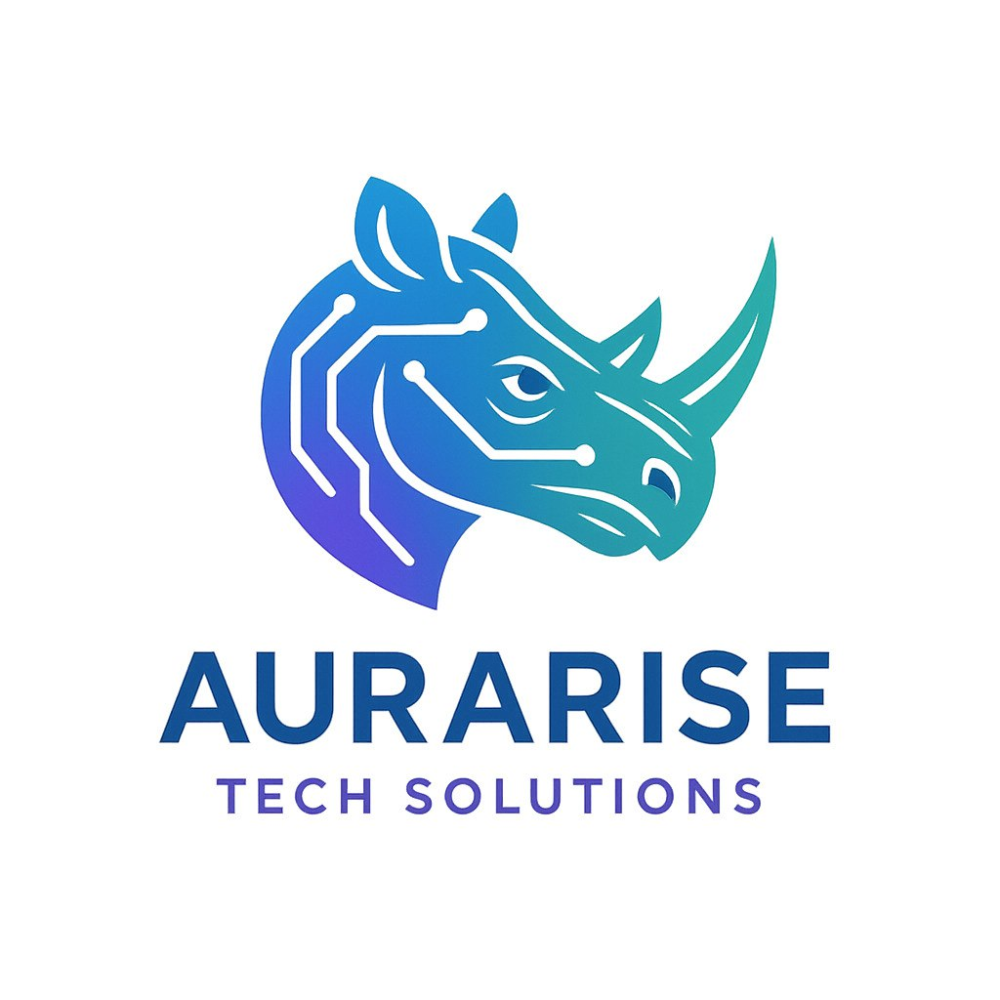

# aurarise Tech Solutions - Enterprise Technology Powerhouse

  
  
  ## አራሪዝ • Enterprise Technology Solutions
  
  **Your trusted partner for enterprise-grade technology solutions, digital transformation, and innovative IT services across Ethiopia and beyond.**

---

## 🚀 About aurarise Tech Solutions

**aurarise Tech Solutions** represents strength, resilience, and power in the technology world. Named after the Amharic word for 'rhino' (አራሪዝ), we deliver robust, enterprise-grade solutions that drive your business forward.

### Our Mission
To empower Ethiopian businesses with cutting-edge technology solutions that enable digital transformation and sustainable growth in the global marketplace.

### Our Vision
To be the leading technology powerhouse in East Africa, known for delivering enterprise-grade solutions that transform businesses and drive innovation.

---

## 🛠️ Our Enterprise Solutions

### **Digital Transformation**
- Strategic technology consulting
- Business process optimization
- Legacy system modernization
- Change management

### **Enterprise Software**
- Custom ERP systems
- Business management platforms
- Workflow automation
- Integration services

### **Cloud & Infrastructure**
- Cloud migration strategies
- Infrastructure optimization
- DevOps implementation
- Security hardening

### **Web & Mobile Development**
- Enterprise web applications
- Cross-platform mobile apps
- Progressive web apps
- API development

### **Cybersecurity**
- Security audits & assessments
- Threat detection systems
- Compliance frameworks
- Security training

### **Data & Analytics**
- Business intelligence
- Data warehousing
- Predictive analytics
- AI/ML solutions

---

## 🏢 Why Choose aurarise Tech Solutions?

### **Enterprise-Grade Quality**
- Proven methodologies and frameworks
- Industry best practices
- Scalable architecture design
- Comprehensive testing protocols

### **Local Expertise, Global Standards**
- Deep understanding of Ethiopian business landscape
- International technology standards
- Multilingual support (Amharic, English)
- Cultural sensitivity in solutions

### **Proven Track Record**
- 25+ experienced professionals
- 7+ years average experience
- 99.5% project success rate
- 100+ successful implementations

### **Strategic Partnership**
- Long-term relationship focus
- Continuous support & maintenance
- Training & knowledge transfer
- Scalable growth solutions

---

## 🌟 Our Core Values

- **Excellence** - Enterprise-grade quality in every project
- **Innovation** - Cutting-edge technology solutions
- **Partnership** - Strategic long-term relationships
- **Reliability** - Dependable enterprise solutions

---

## 📱 Contact Information

- **Phone:** +251 919 312 589
- **Email:** info@aurarisetechsolutions.com
- **Website:** [aurarisetechsolutions.com](https://aurarisetechsolutions.com)
- **Location:** Addis Ababa, Ethiopia

---

## 🚀 Getting Started

Ready to power your business transformation? Contact us for a strategic consultation:

1. **Schedule a Consultation** - Discuss your technology needs
2. **Strategic Assessment** - Evaluate current state and opportunities
3. **Solution Design** - Custom enterprise solution architecture
4. **Implementation** - Professional development and deployment
5. **Support & Growth** - Ongoing maintenance and optimization

---

## 🔧 Technology Stack

- **Frontend:** React, Next.js, TypeScript, Tailwind CSS
- **Backend:** Node.js, Python, Java, .NET
- **Database:** PostgreSQL, MongoDB, MySQL, Redis
- **Cloud:** AWS, Azure, Google Cloud, Local Infrastructure
- **DevOps:** Docker, Kubernetes, CI/CD, Monitoring
- **Security:** OAuth, JWT, SSL/TLS, Security Audits

---

## 📄 License

© 2024 aurarise Tech Solutions. All rights reserved.

---

  
<strong>Powered by aurarise Tech Solutions</strong>

  
<em>አራሪዠ• Your Technology Powerhouse</em>

